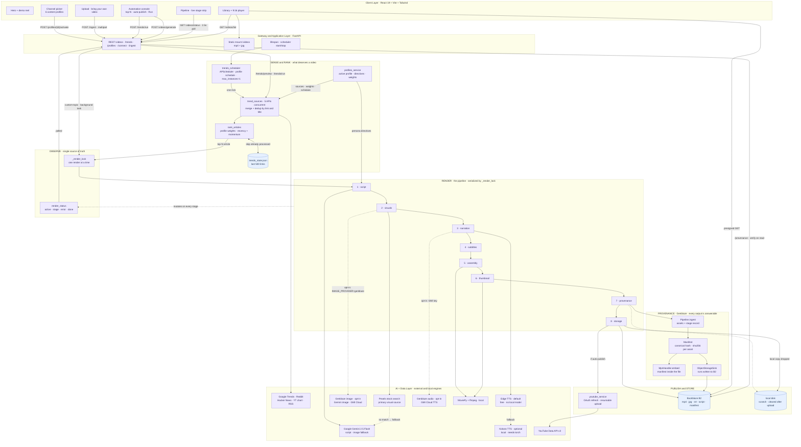

# Flux — Architecture

Technical design of the creator-workflow automation system. For setup and usage
see [README.md](README.md).

Flux does two jobs that share one pipeline:

1. **Automate the whole thing.** Scan the trend sources belonging to the active
   *content profile*, rank what is moving, and render a finished vertical short
   — script, visuals, narration, captions, thumbnail — then publish it.
2. **Package a video the creator already made.** Take an upload and return
   titles, a description, tags, a thumbnail, a caption track and Shorts
   timestamps, then publish it **without re-encoding a single frame**.

Three ideas carry most of the design, and the rest of this document is largely
their consequences:

- **The niche is data, not code.** A content profile is one YAML file. It owns
  the trend sources, the ranking weights, the narrator's voice, the visual
  vocabulary, the category and the schedule. Swapping a markets channel for a
  gaming one changes no Python. See [§4](#4-content-profiles).
- **Durability lives in the bucket, not the host.** Media, the credential vault,
  custom profiles and the active-profile choice are all in Backblaze B2, so an
  ephemeral container can be destroyed at any moment without losing state.
- **Never re-encode a creator's file.** The ingest path reads the video and
  writes small things beside it; the original bytes are what reach YouTube.
  See [§7](#7-ingest-bring-your-own-video).

---

## 1. System overview

Flux is a two-tier application: a **FastAPI backend** that owns the render pipeline and a **React SPA** that drives and observes it.



### Reading the diagram

| Band | What it owns | Why it's its own layer |
|---|---|---|
| **Client** | Rendering state the backend reports; never simulating it | The UI is a viewer, not a second state machine |
| **Gateway** | REST surface, static MP4/JPG mount, scheduler lifespan | One entry point; the static mount means finished videos are served without touching Python |
| **Sense & Rank** | 5 sources → merge → dedup → score → top-N, all driven by the active profile | Deterministic and free, so it can run every cycle without LLM cost |
| **Render** | The 8-stage pipeline, one article at a time | Stages share working directories, so they must be serialized |
| **Observe** | `_render_lock` + `render_status` | The lock enforces serialization; the status dict is the *only* progress truth |
| **Provenance** | Genblaze ingest → manifest → embed → sink | Kept separate from generation: the record is built from the *finished* artefacts, so it describes what was actually shipped, not what was intended |
| **Publish & Store** | Backblaze B2 library, YouTube upload | B2 is the durable home; local disk is scratch. Publishing is optional — a render is complete whether or not it uploads |
| **AI + Data** | Genblaze providers, Gemini, Pexels, Unsplash, Edge TTS, ffmpeg, YouTube API, five trend sources | Everything the pipeline calls out to; the local ones (Kokoro, ffmpeg) dominate runtime |

**Key properties**

- The backend is the single source of truth for render state. The frontend never simulates progress — it polls `/videos/status` and renders whatever stage the backend reports.
- **Storage is not a side effect.** B2 is where the library lives; the API resolves `/list`, `/stream` and `/download` against the bucket and hands out presigned URLs. That is what lets the whole app run on a host with no persistent disk.
- **Every generative dependency is optional.** Pexels → Gemini for visuals; Genblaze → Edge → Kokoro for narration; B2 → local disk. The app boots with zero credentials and reports precisely what is missing on `/health`.
- **Stock beats synthesis for news.** Pexels is the primary visual source by design: a real photograph of a real subject is more credible in a news short than a generated frame, and it costs one fast HTTP GET instead of a per-image generation fee. Genblaze generation is available (`IMAGE_PROVIDER=genblaze`) for topics with no usable stock imagery, but it does not preempt the default path.

---

## 2. Backend components

| Module | Responsibility |
|---|---|
| [`app/main.py`](backend/app/main.py) | FastAPI app, CORS, static mount, lifespan (starts/stops the scheduler) |
| [`app/core/config.py`](backend/app/core/config.py) | Pydantic settings; all paths derived from `BASE_DIR` |
| [`app/api/v1/videos.py`](backend/app/api/v1/videos.py) | generate · status · list · download · stream · delete |
| [`app/api/v1/trends.py`](backend/app/api/v1/trends.py) | scheduler status · ranked preview · manual run · per-source health |
| [`app/api/v1/profiles.py`](backend/app/api/v1/profiles.py) | list · activate · create/delete custom content profiles |
| [`app/api/v1/connect.py`](backend/app/api/v1/connect.py) | publish target · OAuth client · browser OAuth flow · callback page |
| [`app/api/v1/ingest.py`](backend/app/api/v1/ingest.py) | Bring-your-own-video upload, streamed to disk, job status |
| [`app/services/video_service.py`](backend/app/services/video_service.py) | The render pipeline + live status + render lock |
| [`app/services/profiles_service.py`](backend/app/services/profiles_service.py) | Loads YAML presets + custom profiles; derives script directives and ranking weights |
| [`app/services/trend_sources.py`](backend/app/services/trend_sources.py) | Google Trends · Reddit · Hacker News · YouTube chart · RSS, fetched concurrently |
| [`app/services/credentials_service.py`](backend/app/services/credentials_service.py) | Fernet-encrypted credential vault in B2; publish-target state |
| [`app/services/youtube_oauth.py`](backend/app/services/youtube_oauth.py) | Browser OAuth against the visitor's own Google project |
| [`app/services/ingest_service.py`](backend/app/services/ingest_service.py) | Probe · frame pick · transcribe · metadata · clip suggestions · publish |
| [`app/services/keepalive.py`](backend/app/services/keepalive.py) | Self-ping so the host does not idle the service out |
| [`app/services/genblaze_service.py`](backend/app/services/genblaze_service.py) | Genblaze façade: generation pipelines, ingest → manifest, embed, verify |
| [`app/services/genblaze_gemini_image.py`](backend/app/services/genblaze_gemini_image.py) | Custom Genblaze `SyncProvider` for Gemini `generateContent` image models |
| [`app/services/storage_service.py`](backend/app/services/storage_service.py) | Backblaze B2 library: upload, list, presign, delete |
| [`app/services/trends_service.py`](backend/app/services/trends_service.py) | RSS fetch, normalization, ranking, dedup state |
| [`app/services/trends_scheduler.py`](backend/app/services/trends_scheduler.py) | APScheduler job; orchestrates rank → render → publish |
| [`app/services/youtube_service.py`](backend/app/services/youtube_service.py) | OAuth credential loading/refresh, resumable upload |
| [`imagegen/generate_script.py`](backend/imagegen/generate_script.py) | LLM script generation (Gemini or Ollama) |
| [`imagegen/gen_img.py`](backend/imagegen/gen_img.py) | Pexels search → Gemini image fallback (parallel) |
| [`tts/generate_audio_refactored.py`](backend/tts/generate_audio_refactored.py) | Kokoro TTS per narration segment |
| [`assembly/scripts/assembly_video_refactored.py`](backend/assembly/scripts/assembly_video_refactored.py) | MoviePy composition, captions, encode |

### Lazy loading of heavy dependencies

`torch`, `moviepy`, `kokoro` and `opencv` are **imported inside the render task**, not at module import:

```python
def _run_pipeline(self, request, video_filename):
    from imagegen.gen_img import main_generate_images
    from tts.generate_audio_refactored import main_generate_audio
    from assembly.scripts.assembly_video_refactored import create_video, create_complete_srt
```

This keeps the web process light at boot (~tens of MB instead of ~300 MB), so `/health`, `/trends/*` and `/videos/list` stay responsive on small instances and the container starts fast.

---

## 3. The render pipeline

Runs as a FastAPI background task, **serialized by a module-level lock**.

| # | Stage | Key | Implementation |
|---|---|---|---|
| 0 | Clean working dirs | — | wipes `resources/images`, `resources/audio` |
| 1 | Script | `script` | one LLM call → JSON (`audio_script` + `visual_script`) |
| 2 | Visuals | `image` | Pexels per scene, **4-way thread pool**, Gemini generation fallback (Genblaze generation opt-in) |
| 3 | Narration | `voice` | Edge TTS → one `.mp3` per segment, 4-way concurrent (Kokoro `.wav` as fallback) |
| 4 | Subtitles | `subtitles` | timings derived from **actual audio durations** |
| 5 | Assembly | `assembly` | MoviePy: fit → concat → captions → ffmpeg encode |
| 6 | Thumbnail | — | ffmpeg frame grab → `<name>.jpg` |
| 7 | Provenance | `provenance` | Genblaze `Pipeline.ingest` → manifest → embed into the MP4 |
| 8 | Storage | `storage` | Upload every artefact to Backblaze B2, drop the local copy |
| 9 | Publish | `publish` | YouTube resumable upload (optional) |

Stages 2 and 3 record which source actually served each item (`genblaze` /
`pexels` / `gemini`, `genblaze` / `kokoro`), and that per-item record is what
ends up in the manifest — so the provenance reflects the fallbacks that really
fired, not the configured preference.

### Concurrency model

```python
_render_lock = threading.Lock()

def _generate_video_task(self, request, video_filename):
    with _render_lock:
        self._run_pipeline(request, video_filename)
```

Renders **share** working directories (`resources/images`, `resources/audio`, `resources/scripts/script.json`) and each run wipes them at the start. Two concurrent renders therefore delete each other's files mid-flight and both corrupt. The lock makes concurrent requests **queue** instead. The frontend additionally guards against double-submit.

### Live status protocol

A module-level dict is mutated as the pipeline advances and exposed over HTTP:

```python
render_status = {"active": bool, "stage": str|None, "topic": str,
                 "video_filename": str, "error": str|None, "updated_at": float}
```

Stage keys map 1:1 onto the frontend's `pipelineSteps`, so the UI highlights the real stage. `done` is set **after** publishing, which is what the client waits for before navigating to the library.

**Trade-off:** this is in-memory and single-process. A restart mid-render loses it. The frontend detects "backend idle but no new video" for 3 consecutive polls and stops cleanly rather than hanging.

### Duration accuracy

The finished video must match the requested duration:

```
narration_target = requested_duration − INTRO_SECONDS − OUTRO_SECONDS
target_words     = narration_target × WORDS_PER_SECOND      # ≈2.5 w/s
```

The word budget is injected into the LLM prompt as a hard constraint. Bookends default to 2 s each so they don't dominate short videos. Measured: a 15 s request produces a **14.55 s** file.

### Resolution-relative typography

All text sizes derive from the output width, so captions never clip when resolution changes:

```python
SUBTITLE_BOX_W     = int(TARGET_W * 0.90)
SUBTITLE_FONT_SIZE = max(14, int(TARGET_W * 0.055))
TITLE_FONT_SIZE    = max(18, int(TARGET_W * 0.075))
```

Captions use `method='caption'` with **auto height** (`size=(w, None)`) so long lines wrap downward instead of being cut off.

---

## 3b. Provenance and durable storage

### Why this layer exists

Short-form AI news video is trivially cheap to produce and, by default, entirely
unauditable — nothing in the finished MP4 says which model wrote it or where the
imagery came from. Flux closes that gap: **every render is registered as a
Genblaze ingest run whose manifest binds the SHA-256 of each artefact to the
chain of providers and models that produced it.**

### Building the record

The manifest is built from the *finished* artefacts, not from intent:

```python
result = Pipeline.ingest(
    assets,                                # mp4 + thumbnail + srt + script
    source="flux-render-pipeline",
    source_metadata={"topic": ..., "stages": stages},
    sink=object_storage_sink,              # writes the run to B2
    tenant_id=settings.GENBLAZE_TENANT_ID,
)
```

`stages` is accumulated as the pipeline runs and records the source that
*actually* served each stage, including fallbacks. Asset `sha256` and
`size_bytes` are computed locally before ingest rather than left to the sink —
that way `Manifest.verify()` succeeds even when B2 is not configured, so
provenance is not a paid feature of the deployment.

### Two copies, deliberately

| Copy | Where | Role |
|---|---|---|
| Sidecar | `flux/library/{stem}/manifest.json` on B2 | **Authoritative.** What `/provenance` reads and re-verifies |
| Embedded | inside the MP4 (`Mp4Handler.embed`) | Travels with the file — survives download, re-upload, sharing |

Embedding rewrites the container *after* the hashes were computed, so the video
asset's recorded SHA-256 describes the rendered content rather than the
annotated file. That is the intended semantic — provenance should assert what
was generated — but it means the embedded copy cannot be checked with a naive
`sha256sum` of the final file, which is why the sidecar stays authoritative.
`embed_manifest` extracts its own write back and returns `False` if the
container rejected it, rather than claiming a record nobody can read.

### Two constraints the SDK imposes, and how Flux satisfies them

**1. `file://` assets must live under the system temp directory.**
`genblaze_core.storage.transfer` checks every local asset path against a
hardcoded `ALLOWED_FILE_ROOTS` (temp only) — an arbitrary-file-read guard, with
no override plumbed through `ObjectStorageSink`. Flux's artefacts live under
`static/` and `resources/`, so **both** paths that hand local files to Genblaze
stage copies in temp first: `record_render` for the ingest, and `generate_images`
for the provider's output directory. The staged bytes are identical, so every
SHA-256 in the manifest still describes the real artefact.

This is easy to miss in tests — pytest's `tmp_path` *is* inside the temp
directory, so a naive fixture passes while production fails. `tests/` carries an
explicit outside-temp fixture for exactly this reason.

**2. Google's image adapter is Imagen-only, and Imagen is closed.**
`genblaze_google.ImagenProvider` calls the `:predict` endpoint; every `imagen-*`
model now answers *"no longer available to new users"* for keys created after the
cutover, and Google moved image generation to `gemini-*-image` on
`generateContent`. `SyncProvider` is a documented extension point with one
abstract method, so
[`genblaze_gemini_image.py`](backend/app/services/genblaze_gemini_image.py)
implements it against the current API — the assets then flow through the same
Pipeline, sink and manifest as any first-party provider.

### Storage layout

```
flux/library/{stem}/video.mp4      # served via presigned GET
                    thumb.jpg
                    captions.srt
                    script.json
                    manifest.json  # provenance, authoritative
                    meta.json      # library card metadata; written LAST
flux/runs/{tenant}/{date}/{run_id}/manifest.json
                                   assets/…        # Genblaze sink
```

`meta.json` is written last on purpose: a prefix without it is a partially
uploaded render. Listing additionally requires `video.mp4` to exist before an
entry is surfaced, so a failed upload never appears as a broken library card.

Listing is one paginated `ListObjectsV2` over the library prefix, grouped by
stem; `meta.json` is read once per video and cached for the process lifetime
(it is immutable after write), which keeps `/videos/list` to a single round trip
in the steady state.

### Failure posture

Storage and provenance are wrapped so that **neither can fail a render**. If B2
is unreachable the video stays on local disk and the library still lists it with
`storage: "local"`; if the manifest cannot be built the video is stored anyway
with `has_provenance: false`. The one deliberate exception is inside
`upload_render`: if the *video* upload fails after the sink was reported
available, that raises, because silently reporting a B2-backed library that has
no video in it is worse than a logged failure.

---

## 4. Content profiles

A profile is the answer to *"what kind of channel is this?"* — and it is the
only place that answer lives.

Before profiles the niche was smeared across three files: the feed list in
config, the ranking weights in `trends_service`, and a script prompt that named
the Bombay Stock Exchange out loud. A gaming creator could not use the app
without editing Python.

### What a profile owns

```yaml
id: gaming
sources:                                  # where ideas come from
  - { type: reddit, subreddits: [gaming, Games, pcgaming] }
  - { type: youtube_trending, region: US, category: gaming }
  - { type: rss, urls: [https://www.polygon.com/rss/index.xml] }
persona:                                  # how the script sounds
  voice: a plugged-in gaming host who plays the games and reads the patch notes
  audience: gamers aged 16 to 32 who follow releases and industry news
  hook_style: open on the change that will annoy or delight players most
  cta: Follow so you never miss a patch that matters
  avoid: rage-bait framing, spoilers without warning, made-up leaks
visuals:                                  # vocabulary for the stock search
  style: vivid neon-lit gaming photography, high contrast
  subjects: [gaming setups, controllers, arcade lights, esports arenas]
format:  { duration: 45, youtube_category: "20", hashtags: ["#gaming"] }
ranking: { recency: 0.55, trend: 0.45, max_age_hours: 24 }
schedule: { hours: [12, 21], timezone: America/Los_Angeles, top_n: 1 }
```

Six presets ship as YAML in [`app/profiles/`](backend/app/profiles/). Custom
profiles are stored in B2 alongside the credential vault and behave identically.
Adding a seventh preset is a twenty-line file, not a code change.

### How it reaches the model

`script_directives()` renders the persona into the block prepended to the script
prompt. This is the entire mechanism behind "choose your content type" — the
pipeline, the model and the parameters are identical for every niche; what
differs is eight lines of instruction and the stock-search vocabulary beneath
them.

```
CHANNEL: Gaming - Patches, drama, and what to play next
NARRATOR: You are a plugged-in gaming host who plays the games...
AUDIENCE: gamers aged 16 to 32 who follow releases and industry news.
HOOK: open on the change that will annoy or delight players most.
VISUAL STYLE: vivid neon-lit gaming photography, high contrast.
PREFERRED VISUAL SUBJECTS: gaming setups, controllers, arcade lights...
NEVER: rage-bait framing, spoilers without warning, made-up leaks
```

`NEVER` is last and phrased as a hard constraint. It is not decoration: the
fitness profile forbids medical advice and dosage, the entertainment profile
forbids gossip about private lives, and those lines are the difference between a
publishable video and one that should never have been made.

### State and normalisation

The active profile is stored in B2 (`config/profile_state.json`), not in an env
var — `CONTENT_PROFILE` applies only to a first-ever boot, after which the
dashboard choice wins and survives redeploys.

List-shaped fields are coerced on load, because `subjects: [a, b]` and
`subjects: a, b` are both natural to write and the second parses as a plain
string. Joining that string later emitted one entry *per character* into the
image prompt (`"g, a, m, i, n, g"`). Coercing once at load beats defending
against it at every read.

---

## 5. Trending subsystem

### Data flow

The candidate pool comes from whatever sources the **active content profile**
names, fetched concurrently and merged:

```
profile.sources ──┬─▶ google_trends     (daily trending RSS, by geo)
                  ├─▶ reddit            (public listing JSON, RSS fallback)
                  ├─▶ hackernews        (Algolia front page / search)
                  ├─▶ youtube_trending  (mostPopular chart, needs a connected channel)
                  └─▶ rss               (any feed or feeds)
                            │
        ThreadPoolExecutor ─┘   one failing source never takes down the run
                            │
                normalize ──┴──▶ dedup by link AND by normalised title
                                              │
                        filter stale (> max_age_hours) ◀┘
                                              │
                            tokenize + score ─┴──▶ sort desc ──▶ top N
```

Every source normalises to the same `Article` dataclass (`title`, `link`,
`summary`, `source`, `published_ts`) with HTML stripped, so the ranker below is
unchanged from when there was only RSS.

**Why five sources rather than five feeds.** The ranking signal is cross-source
overlap (below). Reading five sections of one newspaper gives correlated
evidence — the same desk, the same editorial judgement. Reading Google Trends,
Reddit and Hacker News gives three genuinely independent votes, so a story that
appears in all three is evidence of momentum rather than of one outlet's
priorities.

**Playing fair.** Every endpoint is public, free and documented. Requests carry
an identifying User-Agent (Reddit rejects the default and is entitled to), each
source is capped, and responses are cached for five minutes so a creator
clicking Refresh does not hammer somebody else's free API.

**Degradation is per-source and silent.** `fetch_all` collects results as
futures complete and logs failures without raising: a run with four of five
sources is still a good run. Reddit in particular refuses the JSON API from some
hosts by resetting the connection rather than returning a status code, so it
falls back to the RSS view of the same listing before giving up. Because a dead
source and an empty result look identical from outside, `/trends/sources`
reports per-source counts.

### Ranking algorithm

```
score = W_RECENCY · recency + W_TREND · trend
```

**The weights belong to the profile**, not to the code. A news channel wants
freshness, an explainer channel wants a story with legs:

| Profile | recency | trend | max_age_hours |
|---|---|---|---|
| Tech News | 0.60 | 0.40 | 18 |
| Markets & Money | 0.45 | 0.55 | 24 |
| Science & Curiosity | 0.30 | 0.70 | 96 |

They are normalised on read, so a profile written as `60/40` and one written as
`0.6/0.4` behave identically and a typo like `0.6/0.6` cannot push a score above
1. The `0.45 / 0.55` pair below is the fallback for a profile that declares none.

**Recency** — linear decay, not exponential, so scores stay interpretable:

```
recency = max(0, 1 − age_seconds / (TRENDS_MAX_AGE_HOURS · 3600))
```
Unknown publish date → `0.5` (neutral). Articles beyond max age are removed from the candidate set entirely.

**Trend (cross-feed momentum)** — the core idea: *a story that appears across many feeds is trending, and its distinctive words will repeat across those articles.*

1. Tokenize `title + summary`: lowercase, `[a-zA-Z']{4,}`, minus a stop-word list (includes domain noise like `india`, `crore`, `lakh`).
2. Build document frequency `df[term]` = number of candidate articles containing that term.
3. Raw score per article: `Σ (df[t] − 1)` over its **unique** terms — it scores once for every *other* article sharing each term.
4. Normalize by the batch maximum → `[0, 1]`.

This is deliberately **not** TF-IDF. TF-IDF rewards *rare* terms; here we want the opposite — terms shared across the corpus signal a story with momentum.

**Properties**
- Deterministic and free (no LLM/API cost), so it can run every cycle.
- Self-normalizing: scores are relative to the current batch, so absolute feed volume doesn't matter.
- Weighted toward breadth (0.55) over freshness (0.45) — a story spanning Markets + Economy + Industry beats a brand-new isolated one.

### Deduplication

Two passes, and the second is the one that matters now:

1. **By link** — the classic case, one feed listing an item twice.
2. **By normalised title** (lowercased, punctuation stripped) — the whole point
   of reading five sources is that a real story appears in several of them.
   Without this pass the same story under five different URLs would occupy all
   five top slots and produce five near-identical videos.

Separately, links already turned into videos persist in
`resources/trends_state.json` (bounded to the last 500) and are excluded from
future candidate sets. They are recorded even when a render *fails*, so one
malformed article cannot block the queue forever.

### Scheduling

`BackgroundScheduler` (thread-based, not asyncio) because the render is blocking
CPU work — running it on the event loop would stall the API. `max_instances=1`
and `coalesce=True` mean a slot arriving mid-render is dropped rather than
queued: renders take minutes, and stacking them would publish a backlog at once.

**The schedule comes from the profile.** Publish hours, timezone and videos per
slot are profile fields, so one deployment can be a US tech channel at
09:00/14:00/18:00 Eastern or an Indian markets channel at 08:00/14:00/20:00 IST
without touching an env var. Env values remain the fallback for a profile that
declares no schedule.

Because a cron trigger is fixed at construction, switching profiles tears the
scheduler down and rebuilds it (`restart_scheduler`) — otherwise new hours would
not take effect until the next deploy.

Two details that came from things going wrong:

- **Fixed wall-clock slots, not an interval.** An interval trigger fires one
  whole interval *after process start*, so on a host that redeploys more often
  than the interval it never came due at all — the scheduler reported itself
  healthy while never having published anything.
- **Missed-slot catch-up.** A deploy at 08:05 would otherwise skip the 08:00
  video entirely. On boot the scheduler compares the last run recorded in B2
  against the most recent slot that has passed, and schedules a catch-up run a
  few minutes later if one was missed.

---

## 6. Credentials and the publish target

### Why a vault at all

The host's filesystem is ephemeral: anything written locally is gone on the next
deploy. A creator who has to reconnect their channel after every push stops
using the tool. So the vault lives in B2 alongside the media.

`credentials_service` encrypts with Fernet and writes a single object to
`{B2_PREFIX}/config/credentials.enc`. The key comes from `FLUX_SECRET_KEY`, and
if that is unset it is derived from the B2 application key — already a secret,
already required for the app to store anything, already stable across deploys.
That makes the vault work on a fresh deploy with nothing extra to configure. It
is a real tradeoff and it is logged: whoever holds the B2 key can decrypt the
vault.

Changing the key makes stored credentials unreadable. The failure is caught and
reported in those words rather than surfacing as "your credentials vanished".

### What the dashboard may set — and what it may not

Only the **YouTube OAuth client**. Model and stock-library keys come from the
environment.

That is a deliberate narrowing. Those keys are the operator's cost centre and
identical for every visitor, so a public form asking for them was pointless and
invited someone to paste a key that then billed them.

Secrets never come back out. `describe()` returns whether a field is set and a
four-character tail — enough to tell two keys apart and nothing more. Saves are
sparse: only keys present in the request body are touched, so a form submitting
one changed field cannot write its masked placeholders over the real secrets
behind the others.

### Two publish targets

| Mode | Token source | Who it is for |
|---|---|---|
| `default` | `YOUTUBE_TOKEN_JSON` from the environment | A first-time visitor who should not have to create a Google Cloud project to try the pipeline |
| `own` | The vault, via the browser OAuth flow | A creator who wants uploads on their channel, using their quota |

In `own` mode a missing token **raises** rather than falling back to the
deployment's channel. Silently publishing a stranger's video to someone else's
account is the worst failure available here, so it fails loudly instead.

### OAuth in the browser

`youtube_oauth` runs the flow against the visitor's *own* Google project, so
this deployment never holds a credential that can touch another account.
Implemented against the raw token endpoint with `requests` rather than
`google-auth-oauthlib`: FastAPI already owns the redirect, so the library would
only be wrapping one HTTP POST.

Three details that are load-bearing:

- **`access_type=offline` *and* `prompt=consent`.** Without the second, Google
  omits the refresh token on every authorisation after the first, and the
  connection dies silently an hour later with nothing to refresh from.
- **The redirect URI is built from the platform's own advertised URL**
  (`RENDER_EXTERNAL_URL`, `RAILWAY_PUBLIC_DOMAIN`, …) and printed verbatim in
  the UI to copy. Google compares it character for character; a trailing slash
  or the wrong scheme is `redirect_uri_mismatch`, which is the single most
  common way this flow fails.
- **A stored token refreshes with its OWN scopes, never the app's list.**
  google-auth sends whatever scopes it holds on the refresh request, and Google
  rejects a refresh asking for scopes the grant never covered. Widening the
  app's `SCOPES` once broke every existing token with `invalid_scope`. A refresh
  cannot change a grant, so it must not try to. `readiness()` reports
  `can_caption` so a token predating caption support says so once rather than
  warning on every upload.

---

## 7. Ingest: bring your own video

A creator who already filmed and edited something still faces the busywork this
project exists to remove. `ingest_service` takes the finished file and does all
of it.

### The one design rule: never re-encode

Re-encoding would cost minutes of CPU and a memory peak a 512 MB instance cannot
survive, and it would degrade footage the creator already graded. So every step
either reads the file or writes something small beside it:

| Step | Cost |
|---|---|
| `probe` | one `ffmpeg -i`, metadata only — imageio-ffmpeg ships no ffprobe, and the banner carries the same information |
| thumbnail | **one** frame extracted, composed to 1280×720 with Pillow |
| audio | 48 kbps mono, ~3 MB for a ten-minute video |
| transcript | that audio to Gemini, which returns timed segments |
| captions | an `.srt` written from those segments |
| metadata | one more Gemini call: titles, description, tags, chapters |
| publish | the **original file**, byte for byte, then thumbnail and captions attached |

Subtitles are never burned in. YouTube renders the `.srt` sidecar itself, for
free, in whatever player the viewer is using — better than burning them, and it
costs nothing instead of a transcode.

### Picking the thumbnail frame

Five candidates are sampled between 15% and 75% and scored by the standard
deviation of an edge-filtered 320px copy; the sharpest wins.

A single frame at a fixed offset is a coin toss. On real footage, 25% in landed
on a motion-blurred stock clip of a number plate and made it the thumbnail. A
frame with a subject in focus has far more edge energy than a smeared or flat
one, so this reliably avoids the bad ones. It picks the *sharpest* frame, not
the most topical — relevance would need a vision pass over the candidates.

### Clip suggestions

Only attempted above 120 seconds: below that the whole video is already the
clip, and asking a model to find the best 30 seconds of a 90-second video wastes
a call to be told "all of it".

Extraction uses stream copy with a **two-stage seek** — fast to a few seconds
early, then an exact trim. An input `-ss` alone is fast but lands on the nearest
earlier keyframe and, with `-c copy`, does not discard what it skipped: asking
for 5 seconds from 0:03 produced an 8.01-second file. An output `-ss` alone is
exact but reads from the beginning every time. Together they are accurate to a
frame and still fast on a long video.

### Failure posture

Captions are valuable but not worth losing an upload over, so `transcribe`
never raises — including when there is no model key. Building the client sits
*inside* the try for exactly that reason: it was outside once, and a missing key
killed the whole job at that step with a message about metadata.

Likewise a rejected thumbnail (custom thumbnails require a verified YouTube
account) is a warning on a published video, not a failed publish.

---

## 8. Frontend architecture

State lives in `App.jsx`; sections are presentational.

| Component | Role |
|---|---|
| `Header` | nav + library search (lifted state) |
| `Hero` | pitch, demo video, pipeline stage strip |
| `AutomationSection` | top-N selector, auto-publish toggle, Run Automation, ranked articles |
| `PipelineSection` | live stage visualization |
| `LibrarySection` / `VideoCard` | newest-first grid, B2 + verified badges, actions |
| `VideoPlayerModal` | fullscreen 9:16-safe player |
| `ProvenanceModal` | manifest viewer: verification banner, generation chain, per-artefact SHA-256, raw JSON |
| `ConfirmDialog` | animated delete confirmation |

### Provenance in the UI

The card badges come from `/videos/list` (cheap — the values are denormalized
into `meta.json` at upload time, so listing never reads a manifest). Opening
**Provenance** hits `/videos/{name}/provenance`, which re-runs
`Manifest.verify()` server-side on read rather than trusting the stored flag —
the badge is a cached hint, the panel is the real check.

### The render watcher

A single interval (2.5 s) drives everything after a render starts:

```
poll ──▶ GET /videos/status ──▶ stage → highlight pipeline
     └─▶ GET /videos/list   ──▶ any name not in baseline? → new video
```

Completion requires the backend to report `done` (set *after* publishing) — not merely the file appearing, which happens one step earlier. A **baseline set** of filenames is captured before starting, so automation runs work even though the client can't know the filename in advance (the backend picks the article).

Termination conditions: `done` → success; `error` → show backend message; backend idle for 3 polls → "no video produced"; `maxAttempts` → timeout. On mount the app also **re-attaches** to an already-running render, so a page refresh doesn't lose the view.

---

## 9. Performance

Measured on a 12-core laptop, 480×854:

| Stage | Original | Optimized | Change |
|---|---|---|---|
| Script | 23 s | **6 s** | `thinkingBudget: 0` on Gemini 2.5 Flash |
| Visuals | 14 s | **3 s** | sequential + `sleep(2)` → 4-way thread pool |
| Narration | 59 s | **~3 s** | local Kokoro → Edge TTS (see below) |
| Subtitles | 3 s | <1 s | — |
| Assembly | 94 s | ~40 s | 480p, `ultrafast`, all cores |
| **Total** | **193 s** | **~60 s** | **−69%** |

### The narration decision was forced by production, not chosen for speed

Kokoro is a good local model, and it was the original design: no API key, fully
offline, ~46 s for a minute of speech. It is also what made the app
**undeployable**.

On a container with an ephemeral disk, Kokoro downloads its ~350 MB model on
every cold start — which means the download happens *during the first render*,
concurrent with the torch load. Peak memory hit ~1.5 GB and the platform
OOM-killed the process. Reproduced twice on the live deployment: script and
visuals completed, then the process died mid-`voice` stage and came back with a
freshly-initialized `render_status` — the giveaway being `updated_at: null`,
since any in-process error would have set `stage: "error"` and a timestamp
instead.

Moving narration to Edge TTS fixed three things at once:

| | Kokoro (local) | Edge TTS (network) |
|---|---|---|
| Narration time | ~46 s | **~3 s** |
| Peak memory | ~1.5 GB | **~300 MB** |
| Image dependencies | +600 MB (torch, transformers, soundfile) | +2 MB |
| Cold start | 350 MB download | none |
| Requires | nothing | network |

Kokoro remains supported (`TTS_PROVIDER=kokoro` + `requirements-kokoro.txt`) for
offline runs. The trade accepted: narration now depends on a network service,
and Edge TTS is an unofficial client for Microsoft's read-aloud endpoint rather
than a contractual API. For a pipeline that already calls Gemini and Pexels over
the network, that is not a new class of dependency — and the fallback chain
means a failure degrades rather than breaks.

`opencv-python-headless` was also dropped: 112 MB, imported by nothing. A render
with `cv2`, `torch`, `kokoro`, `soundfile` and `transformers` all blocked at the
import hook completes normally, which is the test that verified the slim image.

### Why it still isn't seconds

Assembly is now ~65% of the remaining time and is irreducible **given the
product requirement**: publishing demands a real encoded MP4 file.

Systems that generate a "video" in 3–6 seconds (e.g. browser-composed reels) achieve it by **never encoding anything** — they play an image slideshow with on-device speech synthesis. That output cannot be uploaded to YouTube. The choice is therefore architectural, not an optimization gap:

| | Live-composed reel | Flux |
|---|---|---|
| Output | ephemeral browser playback | real `.mp4` |
| TTS | Web Speech API (0 s) | Edge TTS (~3 s) |
| Encode | none | ffmpeg (~40 s) |
| Publishable to YouTube | ❌ | ✅ |

Remaining levers: drop fps 24→20 and remove per-clip fades (~10–15 s), or accept
a lower resolution via `FLUX_VIDEO_WIDTH`/`HEIGHT`.

---

## 10. Design decisions

**One LLM call, not two.** Script generation was originally draft → segment (2 calls). Merged into a single call returning the final timestamped JSON — halves free-tier quota usage and latency. `response_mime_type=application/json` plus an explicit schema in the prompt keeps output parseable; a guard raises loudly if `audio_script` is missing rather than silently saving a broken script.

**Pexels before Gemini.** Stock search is a plain HTTP GET (fast, free, unlimited); image *generation* is slow and quota-limited. Gemini is a fallback only.

**Vertical 480p by default.** Encode time scales with pixel count; 480×854 is ~1/5 the pixels of 1080×1920 and still sharp on mobile, where Shorts are consumed. Resolution is env-configurable for quality-first runs.

**Env-var credentials for deploys.** `secrets/` is gitignored and cloud filesystems are ephemeral, so `YOUTUBE_TOKEN_JSON` can supply the token directly; token refresh writes back best-effort and tolerates read-only filesystems.

**Retries only where they help.** Transient LLM failures (`503`, `429`, `overloaded`) retry with backoff, honoring the server's `retry in Ns` hint. Render failures do not auto-retry — they'd burn quota repeating a deterministic problem.

---

## 11. Known limitations

- **Single-process state.** The render lock and live status are in-memory; horizontal scaling would need Redis or a task queue.
- **One render at a time.** Deliberate (shared working directories), but caps throughput.
- **Embedded-manifest hash semantics.** The recorded video SHA-256 is of the pre-embed bytes (see §3b) — the sidecar on B2 is the authoritative copy.
- **No manifest signing.** `Manifest.signature` is left unset; the canonical hash proves integrity but not authorship. Signing would be the next step toward a C2PA-style claim.
- **Presigned URL churn.** Every `/videos/list` re-signs every entry. Measured at 154 videos: **~34 s cold, ~2.5 s once the URL cache is warm.** The first load of the library therefore looks hung. Pagination, or presigning lazily as cards enter the viewport, is the fix.
- **One workspace per bucket, not per visitor.** The credential vault, the active profile and the library are single objects under `B2_PREFIX`. Two deployments sharing a bucket share all three — switching profile in one changes what the other publishes. Real multi-tenancy would key these by user.
- **Ingest job state is in-memory.** Like render status, it is lost on restart; a job that was mid-flight reports as stopped even though the upload may already be live on the channel.
- **Thumbnail frames are chosen for sharpness, not relevance.** The picker avoids blurred and empty frames but has no idea what the video is about; a vision pass over the candidates would fix it.
- **Clip suggestions are timestamps, not vertical clips.** Stream-copy extraction preserves the source aspect ratio; producing a true 9:16 Short from a landscape source needs a re-encode, which the ingest path deliberately refuses.
- **Simulated stage granularity.** Progress is per-stage, not percentage-within-stage — MoviePy's encode progress isn't surfaced.
- **Narration depends on a network service.** Edge TTS is an unofficial client for Microsoft's read-aloud endpoint. Stable in practice, but not contractual; `TTS_PROVIDER=kokoro` restores offline narration at the cost of ~600 MB of dependencies.
- **Python 3.12 pin** applies only to the optional Kokoro extras; the default image is not otherwise constrained.
